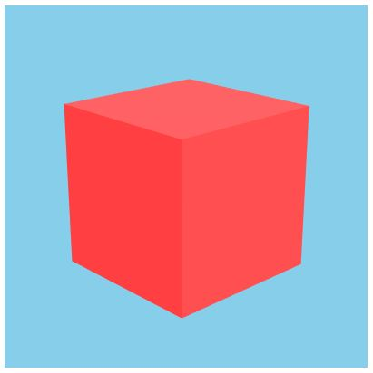

# Three JS starter code

The html canvas connected to a threejs starter code with OrbiterControl configured

# npm scripts

1. npm watch available
2. npm webpack binaries available

# Screenshot

# References

1. https://observablehq.com/@bumbeishvili/three-js-inertion